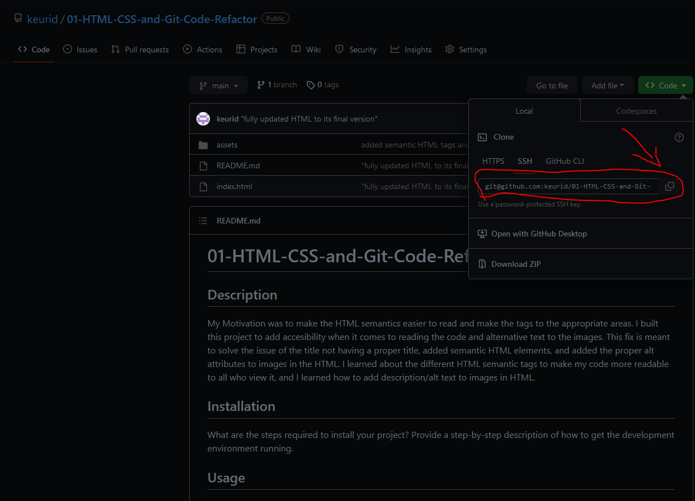
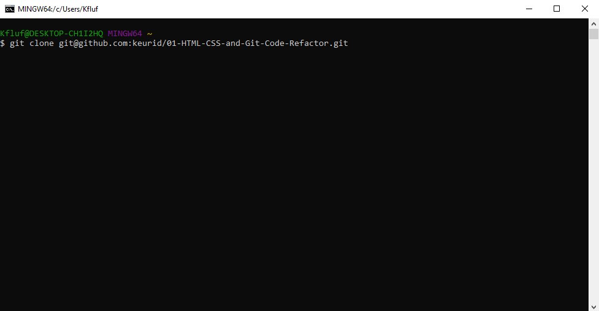
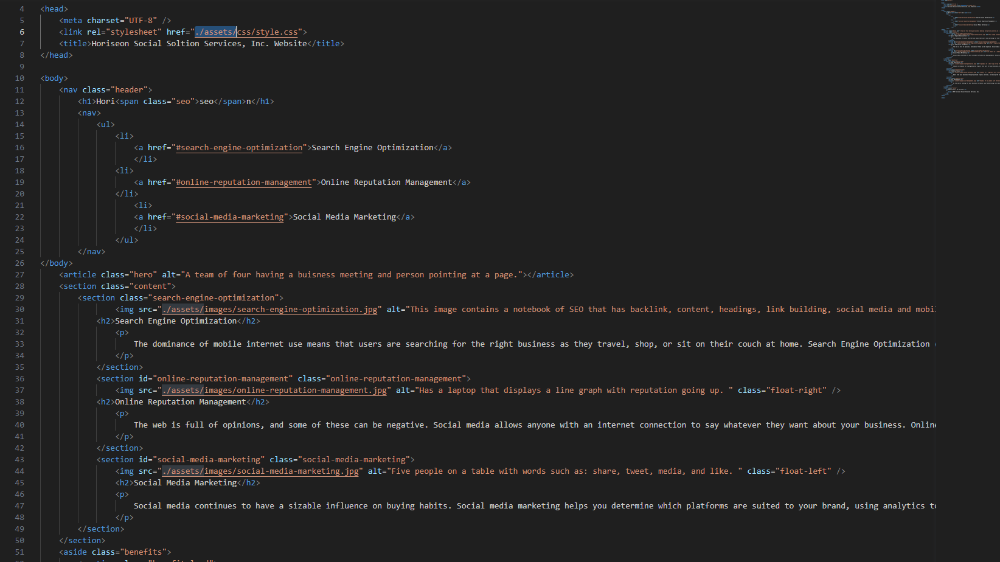

# 01-HTML-CSS-and-Git-Code-Refactor

## Description

My Motivation was to make the HTML semantics easier to read and make the tags to the appropriate areas.
I built this project to add accesibility when it comes to reading the code and alternative text to the images.
This fix is meant to solve the issue of the title not having a proper title, added semantic HTML elements, and added the proper alt attributes to images in the HTML.
I learned about the different HTML semantic tags to make my code more readable to all who view it, and I learned how to add description/alt text to images in HTML.

## Installation

To get the development environment running, first you need to clone the repository by going to 
https://github.com/keurid/01-HTML-CSS-and-Git-Code-Refactor
then copying the link by pressing this button 
after that you can open your Git Bash to clone to repository and access this repository by typing this

## Usage

Now you can access the code and see all changes made.

## Credits
The starter code that was used in this program originates from Xandromus (https://github.com/coding-boot-camp/urban-octo-telegram)
